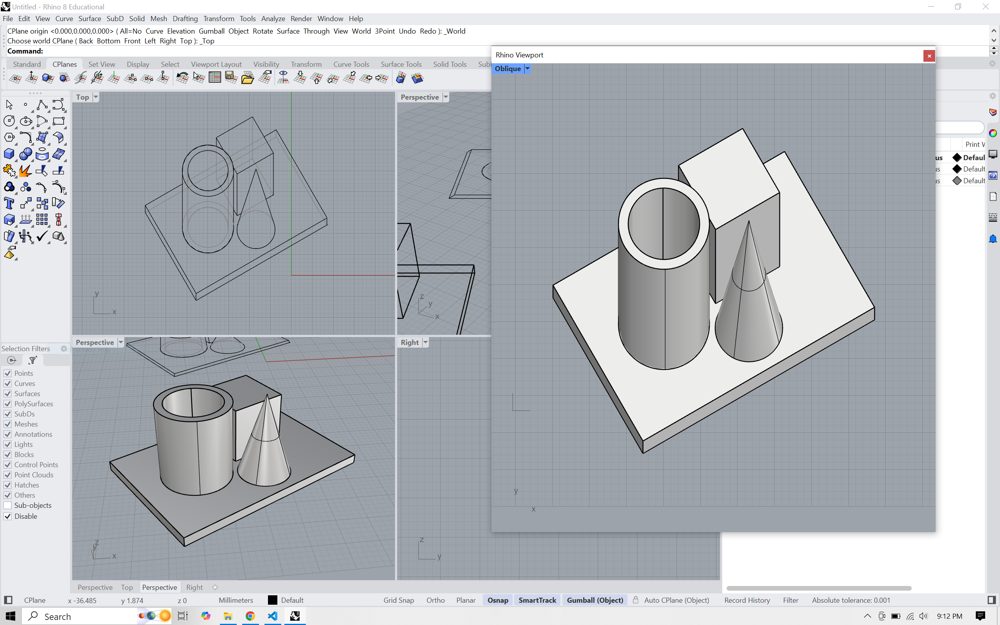

# obliq
Obliq plug-in for Rhinoceros®. Provides utilities for working with oblique (military, cabinet, etc...) projections in a non-destructive way.

> [!NOTE]
> This repository is a forked version by **noahk** of the original [criticalsoftware-lab/obliq](https://github.com/criticalsoftware-lab/obliq) repository by **Galo Canizares**. It has been ported from C++ to C# for Rhino 8 to provide cross-platform support for both Windows and macOS.

**Compatibility:**

* *Rhino 8*: Supported (Windows and macOS)
* *Rhino 7*: In the works (experimental)

## Installation (Rhino 8)

1. Download the latest release and unzip it as a folder named `Obliq`.
2. Move the `Obliq` folder to your Rhino 8 plug-ins directory:
   * **macOS**: `~/Library/Application Support/McNeel/Rhinoceros/8.0/Plug-ins/`
   * **Windows**: `C:\Program Files\Rhino 8\Plug-ins` (or `%APPDATA%\McNeel\Rhinoceros\8.0\Plug-ins\`)
3. **Verify**: Open Rhino 8 and run the `_PlugInManager` command. Ensure `Obliq` is listed and enabled. If it isn't listed, click "Install..." and select `Obliq.rhp` from the folder you moved.
4. Restart Rhino to register all commands.

## Usage

**Commands:**

**Obliq** -> Creates new custom viewport that displays a perfect oblique projection aligned on the Z axis. Also known as a "military" projection or plan oblique. Run again to toggle off.

**ObliqueMake2D** -> Generates a flat, 2D hidden-line drawing of the selected items (might take some time, depending on the amount of geometry).

**ObliqueCurveMake2D** -> Takes a selection of curves and applies an oblique projection, flattening them onto the CPlane.
