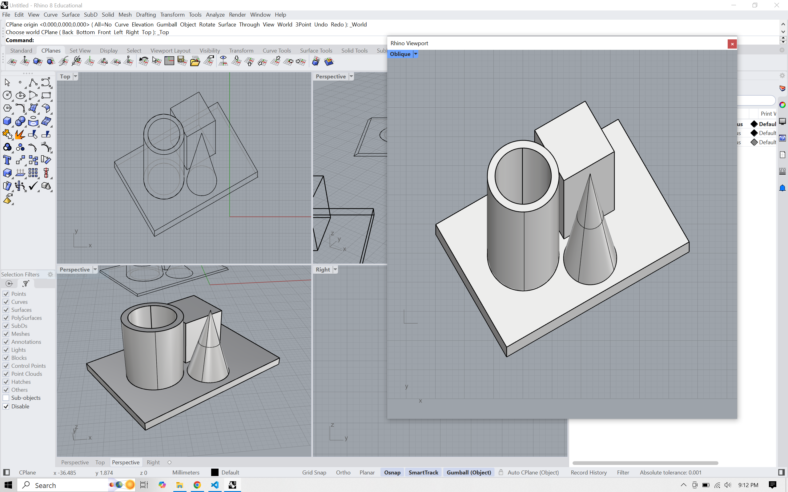

# obliq
Obliq plug-in for Rhinoceros®. Provides utilities for working with oblique (military, cabinet, etc...) projections in a non-destructive way. Written in C# / RhinoCommon for both Mac and Windows.

# Installation (windows)
1. Make sure you have the latest Rhino 8 service release.
2. Run PackageManger from Rhino. Search for Obliq.
3. Click install. Restart Rhino.

# Usage

Obliq is designed to reduce redundancy when producing oblique projection drawings. It works a kind of hack on the viewport, so it's important to understand that the geometric distortion is **visual only**. It does not affect the original geometry. It is primarily designed for the production of line drawings using the familiar Make2D hidden line pipeline.
**Commands:**

**Obliq** -> Creates new custom viewport that displays a perfect oblique projection aligned on the Z axis. Also known as a "military" projection or plan oblique. Opens a floating parallel "Oblique" viewport and binds a display conduit that pushes the oblique shear onto the pipeline's model-transform stack (plan oblique, 90° / 1.0). Geometry is never modified. NOTE: this viewport is for preview purposes only, you cannot model accurately in this viewport due to the custom projection being applied.

**ObliqueMake2D** -> Generates a flat, 2D hidden-line drawing of the selected items based on the current projection set in the Obliq viewport. Output goes to layers `ObliqueMake2D::Visible` and `ObliqueMake2D::Hidden` (dashed if a `Dashed` linetype exists).

**ObliqueCurveMake2D [depreciated]** -> Takes a selection of curves and applies an oblique projection, flattening them onto the CPlane.
